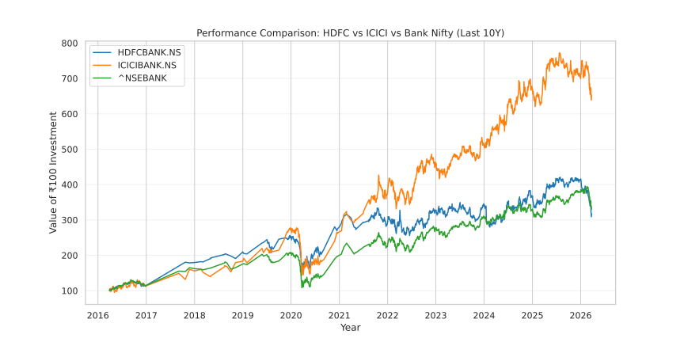

<div align="center">
<h1 align='center'>
📈 Banking sector stock analysis
</h1>
<a href="https://banking-stock-analysis-etl.streamlit.app/">🌐 Interactive App / Live Demo</a>
</div>

---

https://github.com/user-attachments/assets/ef665e12-eeb0-4fb1-8c5d-d07c8d092959

## Visualizations & insights

### Performance comparison (How 100 INR grew for each ticker)



| Ticker        | Annual Returns | Annualized Volatility | Sharpe Ratio | Beta  | Jensen's Alpha |
| ------------- | -------------- | --------------------- | ------------ | ----- | -------------- |
| **HDFCBANK**  | 20.04%         | 35.10%                | 0.38         | 0.965 | -0.01          |
| **ICICIBANK** | 36.24%         | 38.63%                | 0.76         | 1.055 | 0.14           |
| **NSEBANK**   | 21.76%         | 31.41%                | 0.48         | N/A   | N/A            |

- **ICICIBANK Outperforms Sector:** It delivers highest annual return (**36.24%**), beating the benchmark NSEBANK index (**21.76%**).
- **Superior Risk-Adjusted Performance:** ICICIBANK achieved a Sharpe Ratio of **0.76** (compared to HDFCBANK's **0.38** and Nifty Bank's **0.48**), demonstrating that its higher returns outweighed its slightly elevated volatility (**38.63%**).
- **Stronger Alpha:** ICICIBANK produced positive Jensen's Alpha (**+0.14**) with a market Beta of **1.055**, confirming true outperformance driven by stock-specific momentum rather than just general market trends.
- **HDFCBANK Underperformance:** Despite a lower market sensitivity (Beta of **0.965**), HDFCBANK lagged behind the broad index in annual returns (**20.04%**) and generated negative excess returns (Alpha of **-0.01**).

---

## Quickstart

```bash
# Clone repo and navigate to it
git clone https://github.com/ParthamSolanki/Banking-stock-analysis-ETL.git
cd 'Banking-stock-analysis-ETL'

# Create and activate virtual environment
python -m venv .venv
# On macOS / Linux ->
source .venv/bin/activate
# On windows ->
# .venv\Scripts\activate.bat

# Installing dependencies
pip install -r requirements.txt

# Running app
streamlit run app.py
```
